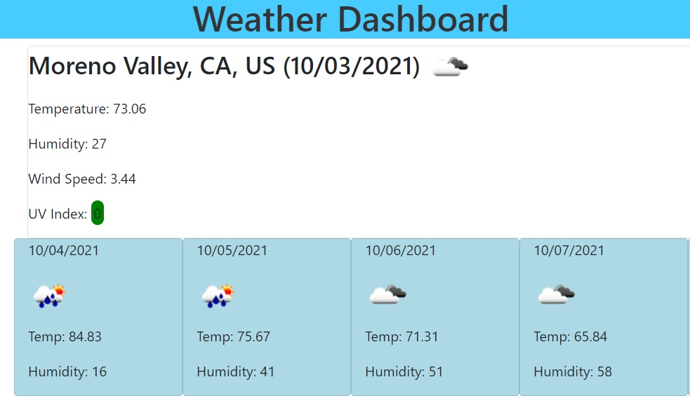

# weather-dash

## Author
Alonzo Roman

## Summary
The purpose of this project is to let the user search for a city and display the weather of that city. Included in the weather is the temperature, humidity, wind speed and UV index, as well as a weather icon for the current weather conditions. Additionally, a five day forecast is displayed with dates, weather icons, temperature, and humidity. Each city searched is loaded into a city history list, and generates button elements that can be clicked to load the respective city's weather data. 

## Screenshot

## Code Snippet

## Steps
- Created files for html, css, and javascript

- Created containers in the html to display weather data on

- Created the function to take the city searched and generate an API request for latitude and longitude codes

- Created the function to take lat and lon and make a One Call Weather API request

- Created the function to display API data and display it as text for current and forecast dates

- Created function to render search history buttons

- Added weather icons and stylization of page

- Created function to use search history buttons to make API request and display weather data

## Deployed Link
- [https://alonzofroman.github.io/weather-dash/](#)

## Technologies Used
- [HTML] (https://developer.mozilla.org/en-US/docs/Web/HTML)
- [CSS] (https://developer.mozilla.org/en-US/docs/Web/CSS)
- [Javascript] (https://developer.mozilla.org/en-US/docs/Web/JavaScript)
- [JQuery] (https://jquery.com/)
- [Bootstrap] (https://getbootstrap.com/)
- [Moment.js] (https://momentjs.com/)

## Contact Links

- Github (https://github.com/alonzofroman)
- LinkedIn (https://www.linkedin.com/in/alonzo-roman/")

## Resources/Acknowledgements 

- W3Schools (https://www.w3schools.com/)
- MDN Web Docs (https://developer.mozilla.org/en-US/)
- Bootstrap Library (https://getbootstrap.com/docs/5.1/forms/input-group/)
- MomentJS (https://momentjscom.readthedocs.io/en/latest/)
- Font Awesome (https://fontawesome.com/v4.7/)

